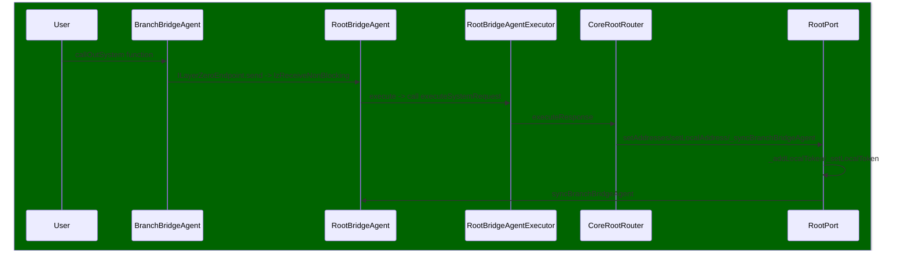
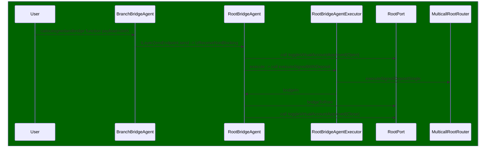
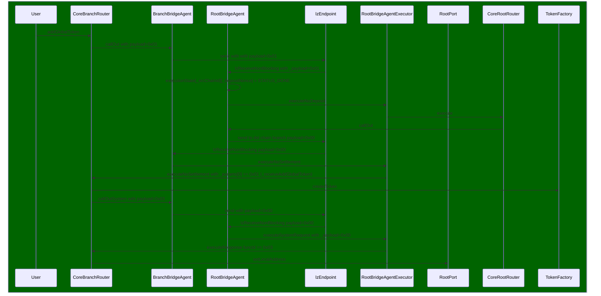
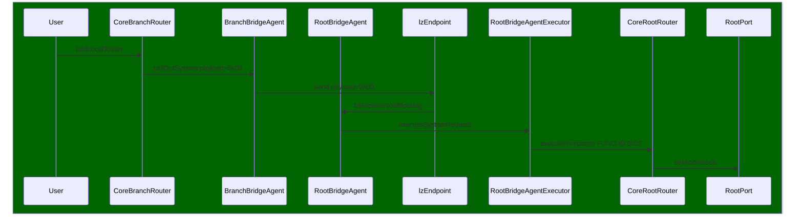

## Overview of Components

1. **RootPort:**
   Responsible for holding all token information and receiving messages from various entities like `BridgeAgent`, `BridgeAgentFactory`, `LocalBranchPort`, and `CoreRootRouter`. It plays a central role in the graph.

   Functions:
   - `callOut`: Function to perform a call to the Root Omnichain Router without token deposit.
   - `callOutSigned`: Perform a call to the Root Omnichain Router without token deposit with msg.sender information.

2. **BranchBridgeAgent:**
   Acts as a `LayerZeroReceiver`, sending messages to `Lz` and utilizing `BranchBridgeAgentExecutor` for settlements.

3. **BranchBridgeAgentExecutor:**
   This contract handles token deposit clearance requests and executes transactions in response to requests from the root environment.

   Functions:
   - `executeWithSettlement`: Executes a single settlement.
   - `executeWithSettlementMultiple`: Executes multiple settlements.

   Settlement related logic is in `CoreBranchRouter`.

4. **CoreBranchRouter:**
   Contains user-related functions such as `addGlobalToken` and `addLocalToken`. It is called by `BranchBridgeAgentExecutor`. The `executeNoSettlement` function implements real logic, with related logic residing in `BranchPort`.

5. **BranchPort:**
   Branch Ports manage deposited balances into the system, while the Root Ports maintain accounting of every deposit in every Branch Port. It represents the last station of the protocol, focusing on token transfers and permission management.

6. **BranchBridgeAgentFactory:**
   In charge of creating `BridgeAgent` and is called by `CoreBranchRouter`.

7. **MulticallRootRouter:**
   Deals with money-related operations. If you intend to move user funds, this is where you should focus.

8. **VirtualAccount:**
   Checks `RootPort` for permissions and executes the required actions. Supports `nopayable` or `payable` actions.

## User Flow

- if it is a signed call, then the user needs to start the bridgeAgent directly
- If it is non-signed, then the user can choose between both bridgeAgent and BaseBranchRouter
- If it is a system/admin call, like adding a new token, the user needs to use the CoreBranchRouter

Here is mermaid sequence graph:

### System Call

### Swap Interaction Flow

### addGlobalToken

### addLocalToken

### Time spent:
20 hours