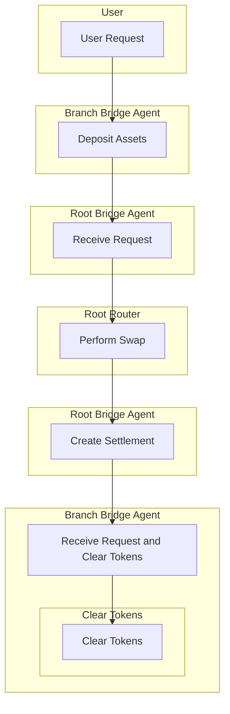

# Maia DAO - Ulysses Smart Contracts Analysis

## Table of Contents
- [Maia DAO - Ulysses Smart Contracts Analysis](#maia-dao---ulysses-smart-contracts-analysis)
  - [Table of Contents](#table-of-contents)
  - [The Process and Steps We Followed for Codebase Evaluation](#the-process-and-steps-we-followed-for-codebase-evaluation)
  - [Description Overview of Maia DAO - Ulysses](#description-overview-of-maia-dao---ulysses)
  - [1- Maia DAO - Ulysses Mechanism Review](#1--maia-dao---ulysses-mechanism-review)
  - [2- Architecture](#2--architecture)
  - [3- Centralization Risks](#3--centralization-risks)
  - [4- Swap Interaction Flow](#4--swap-interaction-flow)
  - [5- Testing](#5--testing)
  - [6- Security Approach of the Project](#6--security-approach-of-the-project)
  - [7- Learnings](#7--learnings)
  - [8- Documentation](#8--documentation)
  - [9- Monitoring Recommendations](#9--monitoring-recommendations)
  - [Time Spent ⏱](#time-spent-)

## The Process and Steps We Followed for Codebase Evaluation
Our ``approach`` to analyzing the source code of the ``Maia Protocol`` was to simplify the information provided by the protocol, using a variety of ``diagrams`` to visually clarify the project's key contracts and break down each important part of these contracts. This enhances understanding for ``developers``, ``security researchers``, and ``users`` alike. We identified the fundamental concepts and employed simpler language to explain the functionality and goals of the ``Ulysses Protocol``. Furthermore, we organized the information logically into separate sections, each with identifying titles, to provide a clear overall picture of the subject. Our primary goal was to make the information more ``accessible`` and ``easy`` to understand.

## Description Overview of Maia DAO - Ulysses

``Ulysses Protocol`` is a decentralized, ``permissionless DeFi`` platform designed to enhance `liquidity` efficiency across ``multiple chains``. It ``enables`` liquidity providers to deploy assets on a variety of chains and earn income, simplifying asset management across ``different chains`` and facilitating ``cross-chain transactions``. Its approach involves creating a single token that represents liquidity across multiple chains, promoting composability in ``DeFi``, and utilizing contracts to efficiently manage balances and addresses within a multichain ecosystem.

## 1- Maia DAO - Ulysses Mechanism Review
- **Scope**
 The ``Maia DAO - Ulysses protocol`` provided a [Scope](https://github.com/code-423n4/2023-09-maia/blob/main/scope.txt) that includes 22 interfaces, 5 factories, and 17 contracts. 
 Let's take a look at the essential functions of these contracts that we considered more difficult and importants.

  - **RootBridgeAgent.sol**: 
        This is a crucial component of the ``Maia DAO - Ulysses`` protocol. Its primary function is to facilitate the secure transfer of assets between different blockchains within the Maia ecosystem.

  

  - **BranchPort.sol**: 
        This contract is an important part of the ``system`` that enables the management of tokens and port strategies, interaction with ``bridge agents``, and the configuration of different elements within ``Maia DAO - Ulysses``.

  

  - **BranchBridgeAgent.sol**: 
        This ``smart contract`` is designed to facilitate ``interoperability`` between two chains. It allows for ``asset transfers``, ``deposit management``, and ``settlements`` between the ``local chain`` and the ``root chain``. It also leverages ``Layer Zero`` for ``cross-chain`` communication and provides security mechanisms such as ``modifiers`` and ``fallback`` functions to ensure secure execution of cross-chain operations.

  

## 2- Architecture
The ``Ulysses Omnichain system`` aims to implement cross-chain messaging and asset transfer, which is naturally a complex challenge and inherently requires complex code. The architecture is difficult to grasp, however, after thorough review, we conclude that it is of high enough quality to efficiently achieve the underlying task. The implementation of the ``Ports`` and ``BridgeAgents`` is of high quality. 

However, the Routers seem to contain functionality that needs to be extended by dApp developers. Moreover, some of the provided Router contracts had functions that weren't implemented (reverting by default), making it difficult to assess whether there could be potential issues arising from that. There are parts of the Root & Branch BridgeAgent’s implementation such as the [lzReceiveNonBlocking](https://github.com/code-423n4/2023-09-maia/blob/main/src/RootBridgeAgent.sol#L434-L737) function that are very long and complex that could benefit from extraction in another contract for better readability. 

``Documentation`` should also be expanded upon and include high-level architecture resources such as diagrams (We take care of creating our diagrams to better understand certain contracts. Maia's team can use them so that future auditors, developers, or users can have a better understanding of the protocol), user & contract interaction flows from the perspective of different participants.

## 3- Centralization Risks
- The centralization risks mainly revolve around the deployed factories. To mitigate these risks and improve trust in the ecosystem, it is recommended that the developers follow a roadmap for gradually transferring ownership to the DAO.

## 4- Swap Interaction Flow
Let's examine a swap example to understand user interaction with `Branch` and `Root Routers`.

These ``Bridge Agents`` not only receive and broadcast user requests but also take on the responsibility for the system's responses. By acting as an intermediary between the `user` and the `system`, it ensures that the connection is made without any issues.

## 5- Testing
This stage of the audit involved a comprehensive testing of the previously identified doubtful and vulnerable areas. This stage involved diving deeper into these areas, performing in-depth examinations, and subjecting them to rigorous testing, including `fuzzing` with various inputs.

While the test suite has some flaws, such as lengthy and hard-to-follow setup functions, and a lack of complex tests involving nested operations the overall testability of the system is commendable. Once the setup is understood, experimenting, developing tests, and implementing PoCs become easy. The developers have provided a high-quality testing sandbox for implementing, testing, and expanding ideas.

## 6- Security Approach of the Project
Successful current security understanding of the project:
1. First they did the main audit from a reputable auditing organization like ``Zellic`` and resolved all the security concerns in the report. 
2. They manage the ``2nd`` and ``3nd`` audit process with an innovative audit such as ``Code4rena``, in which many ``auditors`` examine the codes.

What the project should add in the understanding of Security:
1. By distributing the project to testnets, ensuring that the audits are carried out in onchain audit. (This will increase coverage). 
2. After the project is published on the mainnet, there should be emergency action plans (not found in the documents)-

## 7- Learnings
- We are very impressed and grateful for the approach the team has taken in implementing the [ExcessivelySafeCall](https://github.com/nomad-xyz/ExcessivelySafeCall#excessivelysafecall) library in the protocol. This library adds a significant additional layer of security to the protocol, showcasing the team's commitment to the protection and integrity of the platform. "``ExcessivelySafeCall``" is presented as a valuable tool that helps mitigate potential threats and ensures the robustness of the system. Here is a [link](https://github.com/nomad-xyz/ExcessivelySafeCall#when-would-i-use-this) to the devs, auditors and users who wanna learn more about the `ExcessivelySafeCall` library and what prevents.

## 8- Documentation
The documentation of the Maia DAO - Ulysses project is quite comprehensive and detailed, providing a solid overview of how `Ulysses Omnichain` is structured and how its various aspects function. However, we have noticed that there is room for additional details, such as diagrams, to gain a deeper understanding of how different contracts interact and the functions they implement. With considerable enthusiasm, we have dedicated some days to creating diagrams for some contracts. We are confident that these diagrams will bring significant value to the protocol as they can be seamlessly integrated into the existing documentation, enriching it and providing a more comprehensive and detailed understanding for `users, developers and auditors`.

## 9- Monitoring Recommendations
While ``audits`` help in ``identifying`` code-level ``issues`` in the current implementation and potentially the code ``deployed`` in production, the ``Maia`` team is encouraged to consider incorporating monitoring activities in the production environment. Ongoing monitoring of deployed contracts helps identify potential threats and issues affecting production environments. With the goal of providing a complete ``security assessment``, the monitoring ``recommendations`` section raises several actions addressing trust assumptions and out-of-scope components that can benefit from ``on-chain monitoring``.

## Time Spent ⏱
A total of `7 days` were dedicated to completing this audit.

### Time spent:
42 hours