# Analysis of the code base

## Branch vs Root

Root chain is the virtual chain that manages the whole bridging service. Branch is EVM-based chain that uses the bridging service.

Root is operated at Arbitrum chain, but ‘Root chain’ doesn’t mean Arbitrum chain. Arbitrum chain also treats as one of its branches and is separate from the management features.

## hToken

hToken is a token for managing bridged assets, which is matched 1:1 with the underlying token deposited in the bridge. 

There are two types of hTokens: branch hTokens and root hTokens.The root hToken is also known as the global token, which is minted only when the underlying token is deposited at branch bridge.

The branch hToken can be received when requesting bridging from the root chain to a branch chain, if user choose to receive it as an hToken rather than an underlying token.

Here's an example. You want to bridge a token called USDC. The existing USDC token is the underlying token.

USDC tokens exist on both the Ethereum and Polygon chains. However, even though they are the same USDC token, the bridge system manages them separately on each chain, and you should think of them as two different, independent tokens.

A global token is created for each chain's USDC (Underlying token), and if you bring Ethereum's USDC to Polygon, it will be minted as a branch hToken token. (See Polygon's blue Ethereum USDC branch hToken minted)

Branch hTokens do not need to exist on every chain. If you want to move Polygon's USDC to Ethereum but there is no branch hToken for Polygon USDC, you can first requesting to deploy a Polygon USDC branch hToken, and second move your Polygon USDC into Ethereum as branch hToken.

Arbitrum does not have a branch hToken, but uses the Root hToken(global token) directly. Because it operates on the same chain, it can be minted/burned directly without going through LZ.

## Virtual Account

One Virtual Account contract per user address is assigned to the root chain. For example, if you use an EOA to bridge tokens to the root chain, it transfers or mints global token to the Virtual Account contract owned by that EOA.

The Virtual Account can only be accessed by a preregistered Router contract or EOA. By putting a payload into the virtual account, you can make contract do arbitrary contract call and send/receive NFTs.

## Contract relationship

The user requests bridging by calling a function on the Router or Bridge Agent.

The Bridge Agent is responsible for receiving the user's request and passing it to the LayerZero endpoint, or receiving and processing messages from the LayerZero endpoint.

The Bridge agent executor is called when a bridging request comes in. It is responsible for giving the bridged token and passing the task to the Router if further action is required.

Port manages deposited underlying token and hToken. There is one Port for each chain, and it stores the underlying token deposited by the user for bridging and manages the hToken.

Each chain has one Core bridge agent/bridge agent executor/router, and many regular bridge agent/bridge agent executor/router sets which using customized routers. 

If a user wants to integrate their own logic into the bridge, they can deploy an agent, agent executor, and router to root and branch. The agent and agent executor are generated by the factory, while the router can be customized and deployed by the user. User can add the desired tasks to the router to integrate with the bridge.

A user-deployed root agent needs a branch agent to communicate with it. They should be deployed in pairs.

## Bridging from a branch chain to root chain

### Single asset

Move tokens from the branch chain to the root chain. If a user passes some payloads as a parameter, user can do extra work like swap, and move it to another branch chain.

If user moves branch hToken to the root chain, the branch hToken will be burned. For the underlying token, it is deposited to the Branch Port.

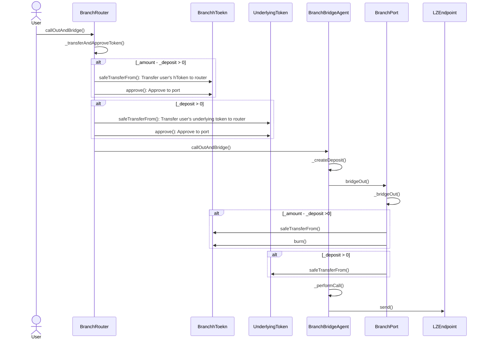

This request is forwarded to the root chain via LayerZero. The root hToken (global token) is transfered from the port and sent to the router, or minted to the router.

If the user passes on additional payload, the router handles it. If you want to do a swap and re-bridge, the router can handle that.

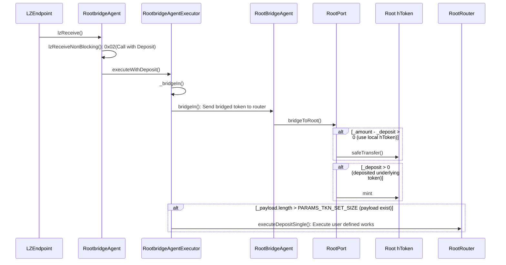

### Batch asset

If you want to move multiple tokens at once, you can use the Batch function. With the same logic, burn the branch hToken or deposit the underlying token to the branch port and pass a message to LZ.

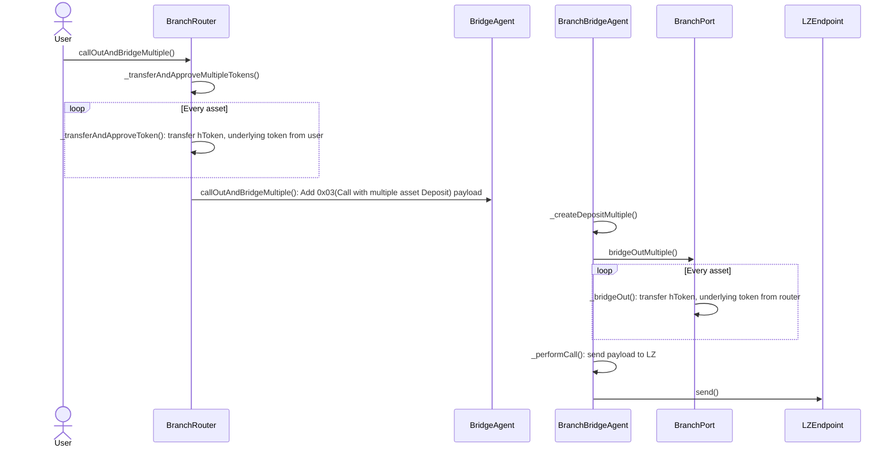

The rootchain side receives the message from LZ and give the tokens.

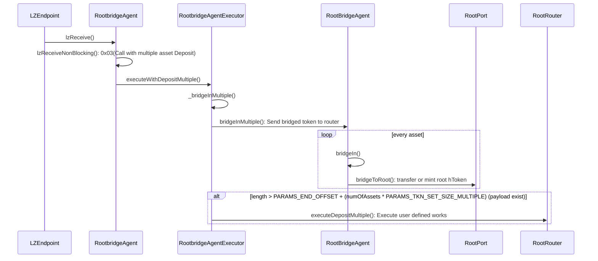

## Managing

### Deploying a third-party branch hToken for an already existing global token

This should be requested from the branch core router. Call `addGlobalToken` when you want to deploy a branch hToken for a global token already registered at the root. i.e. When you want to bridge Ethereum USDC to Polygon.

It can be called by anyone, so anyone can request the deploy of a branch hToken.

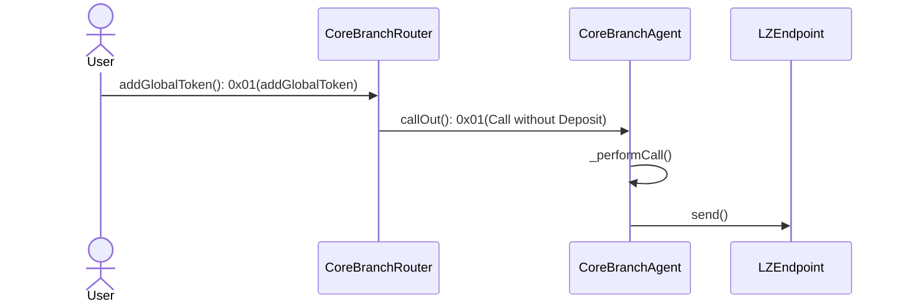

This is passed to the root chain. The root chain sends a `_receiveAddGlobalToken` message to the branch to authorize the deploy branch hToken.

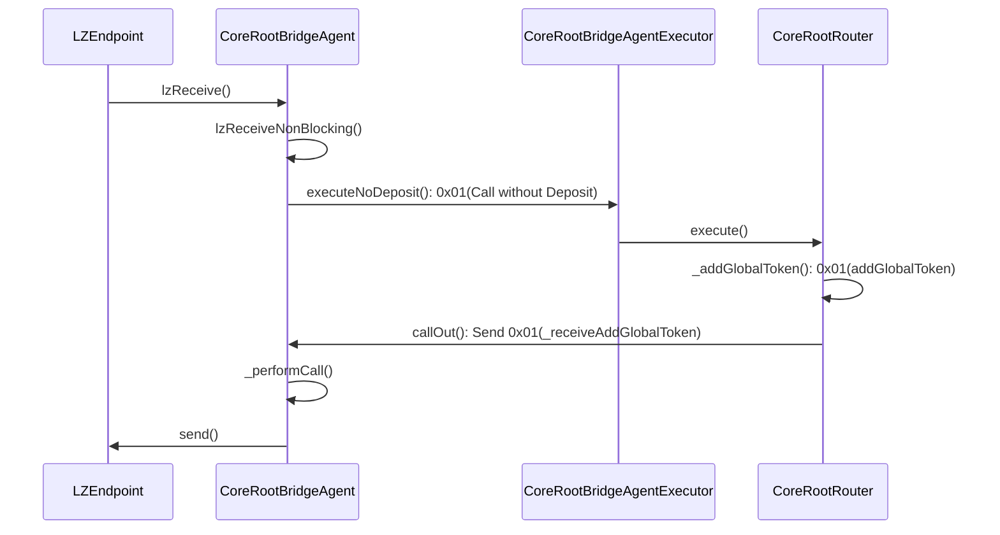

After receiving the message from root, the branch chain deploys the hToken contract and passes the deployed hToken address back to LZ to notify the root chain.

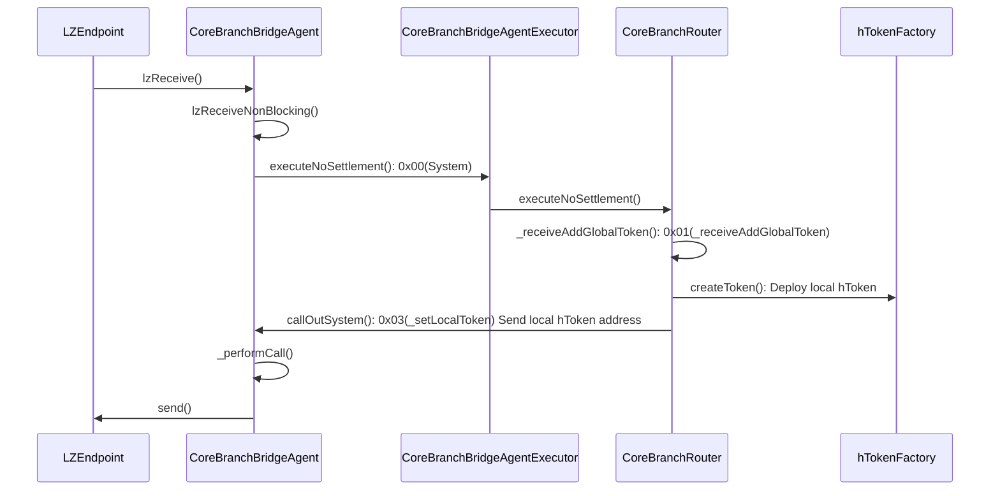

After receiving the message, the root chain calls `_setLocalToken` to store the issued branch hToken address in the Root port.

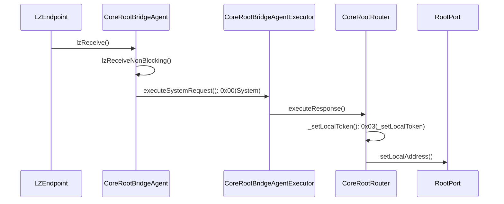

### Create new underlying/branch hToken pair, and global hToken

Deploy a new hToken to the branch, link the underlying token, and notify the root chain. The root chain deploys a global token (root hToken) that matches the created branch hToken.

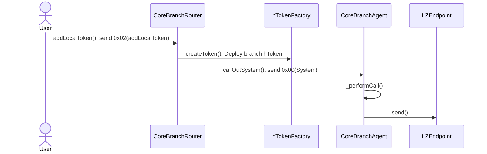

On the root side, it registers the deployed hToken and the underlying token address and deploys a global token (root hToken).

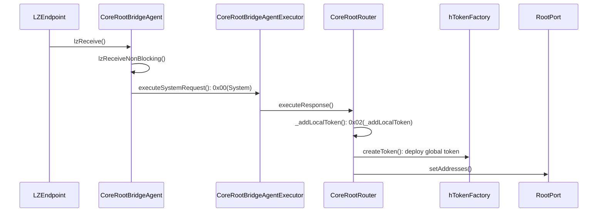

### Register new chain

Only administrators can register a new chain. First, the contract must be deployed and the environment set up on the branch chain side. During the branch deployment, the branch hToken of the native token is deployed.

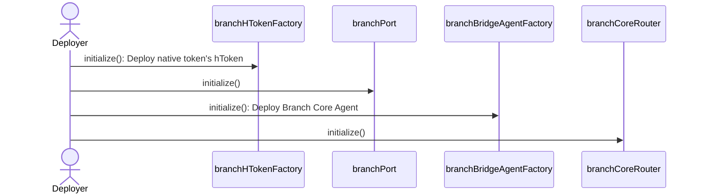

Register the chain information by calling RootPort's `addNewChain` with the deployed native token address and contract information.

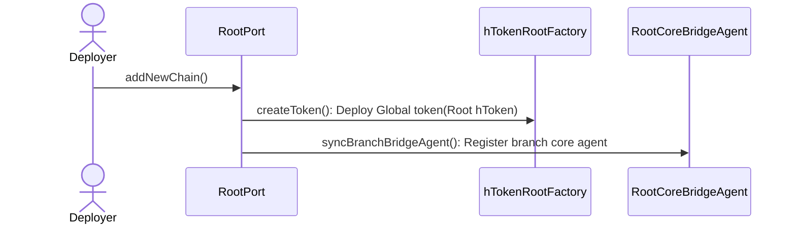

### Add new branch bridge agent

To get your own custom router, you need the bridge agent/bridge agent executor/router set on the root and branches. First, deploy the bridge agent/bridge agent executor/router set in the root chain.

In order to add a Branch bridge agent of a specific Branch chain, the person who deployed the Root bridge agent (the Manager) must first allow this branch chain to be used. 

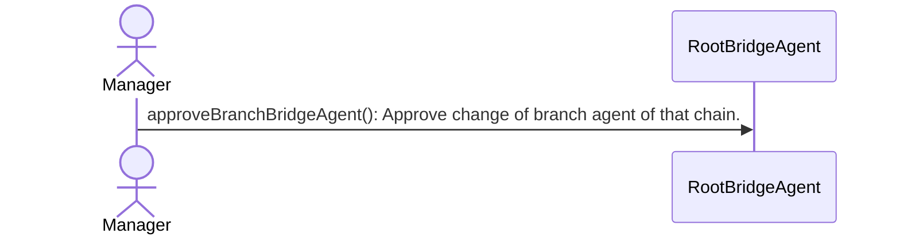

The manager then initiates the request by calling CoreRootRouter's `addBranchToBridgeAgent`. The request is passed to the branch.

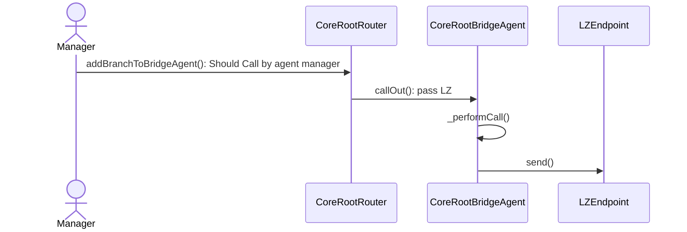

The request passed the LayerZero and calls the core branch agent. The new branch agent is deployed at `_receiveAddBridgeAgent`, and then sends the new branch agent address to the rootchain.

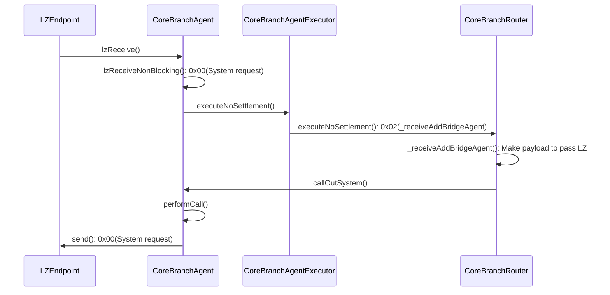

Receive messages from the root chain through the bridge. Finish by setting the branch agent address associated with the root agent. Once set, the branch agent cannot be changed. 

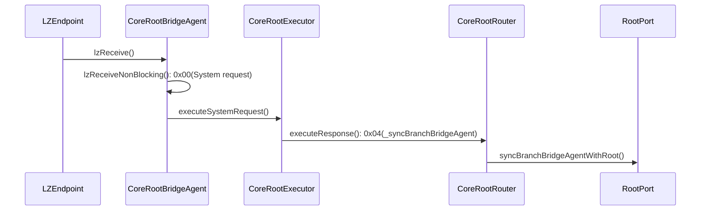

### Time spent:
36 hours